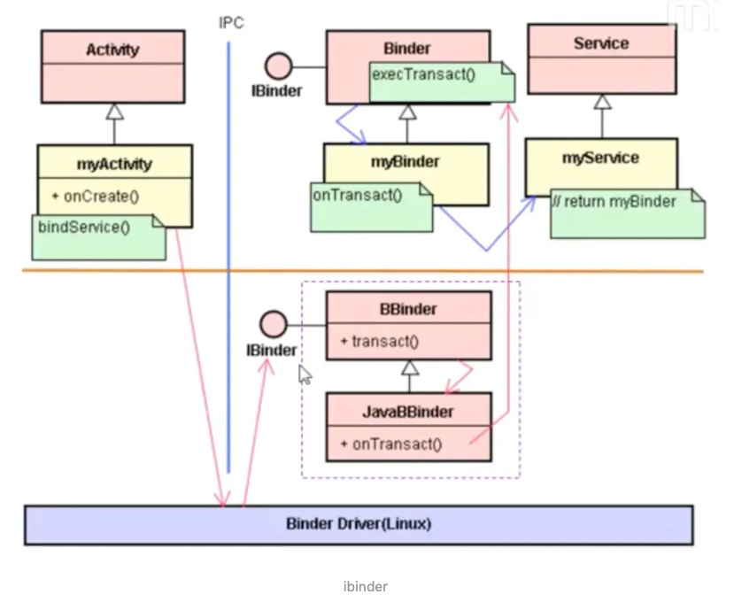
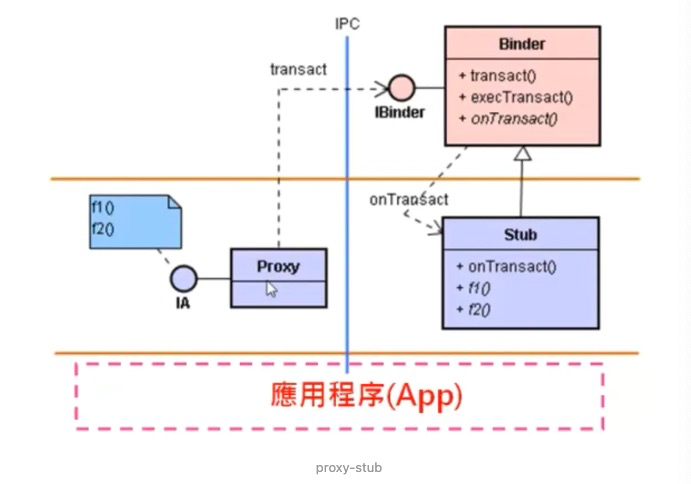
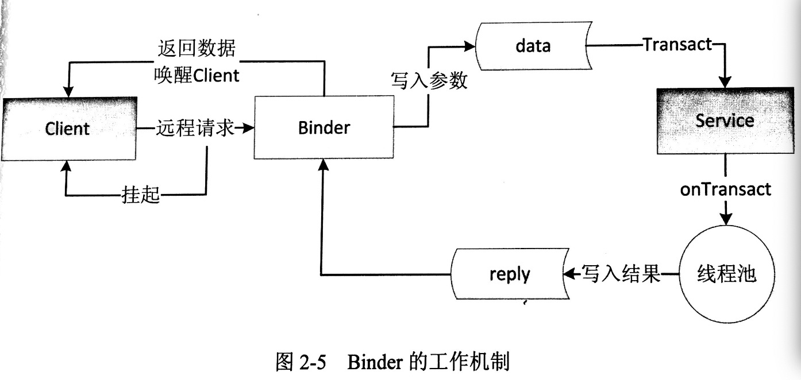

#进程间通讯基本概念IPC，Binder，proxy，stub，AIDL，oneway


##1.IPC
IPC：Inter-Process Communication，指进程间通信或者跨进程通信，即两个进程之间进行数据交换的过程。
某一应用程序（App）时，android系统里的Zygote服务孵化（Fork）一个新的进程（progress）给它，然后将它（App）加载到这个新诞生的进程里。一个进程是一个独立的执行空间，不会被正在其他进程里的程序锁侵犯。
Android中，有特色的进程间通信方式就是Binder。
Android实现跨进程通信的方式有很多，比如通过Intent来传递数据，共享文件SharedPreference，基于Binder的Messenger和AIDL以及Socket等。
要想让对象在进程间传递（或者保存到本地，或者在网络中传递），需要对对象进行序列化。
序列化的方式有两种：Serializable接口，Parcelable接口。
Serializable：是Java提供的一个序列化接口，它是一个空接口，为对象标准的序列化和反序列化操作。其使用起来简单但是开销很大，在序列化和反序列化过程中需要大量的I/O操作。

Parcelable：Parcelable是Android中的序列化方式，因此更适合用在Android平台上。序列化、反序列化和内容描述序列化功能有writeToParcel方法来完成，最终是通过Parcel中的一系列write方法来完成的

e.g.pcode\packages\apps\Car\Radio\src\com\android\car\radio\bands\ProgramType.java

```java

public abstract class ProgramType implements Parcelable {
    public static final int ID_AM = 1;
    //...
    @Override
    public void writeToParcel(Parcel dest, int flags) {
        dest.writeInt(id);
    }
    //...
}

```

##2.Binder
Binder实现了IBinder接口。BindProxy也实现了IBinder。
从多种角度看Binder：
从IPC角度：Binder是Android中的一种跨进程通信方式；

从物理硬件角度：一种虚拟的物理设备，它的设备驱动是/dev/binder；

从Framework角度：Binder是ServiceManager连接各种Manager(ActivityManager、WindowManager等等)和相应ManagerService的桥梁 ；

从Android应用层角度：Binder是客户端和服务端进行通信的媒介，当bindService的时候，服务端会返回一个包含了服务端业务调用的Binder对象，通过Binder对象，客户端就可以获取服务端提供的服务或者数据，这里的服务包括普通服务和基于AIDL的服务。



##3.Stub，Proxy
Proxy模式，也称代理模式，是经典设计模式中的一种结构型模式，其定义是为其他对象提供一种代理以控制对这个对象的访问，简单的说就是在访问和被访问对象中间加上的一个间接层，以隔离访问者和被访问者的实现细节。e.g.ActivityManager 作为客户端要访问 AMS，AMS 不希望直接暴露在客户端面前，或者不想被客户端的某些操作影响到自己内部结构，就暴露出一个代理对象ActivityManagerProxy，让ActivityManagerProxy参与客户端与服务端的交互。
RemoteService具体实现了Stub，Proxy是Stub在本地Activity的代理。Proxy与Stub依靠transact和onTransact通信，Proxy与Stub的封装设计最终很方便地完成了Activity与RemoteService跨进程通信。


##4.AIDL
跨进程通讯AIDL就是帮我们实现了Proxy和Stub模式。封装好了编码和译码功能。底层还是transact和onTransact方法的调用。
AIDL的基本使用，流程可以概括为：
（1）创建服务端的AIDL文件，进行服务端方法的接口定义(IStudentService)；

（2）创建服务端的Service，实现AIDL接口定义的方法，并将Binder对象通过onBind方法返回给客户端；

（3）创建客户端的AIDL文件，从服务端拷贝即可，但要保持AIDL文件的包名结构在服务端和客户端是一致的；

（4）客户端绑定服务端Service，在成功建立与Service的连接之后，拿到服务端返回的Binder对象，并将Binder对象转为AIDL接口类型的对象(IStudentService)；

（5）通过IStudentService类型对象调用Service中的实现方法；

（6）在需要结束与服务端连接的时候，调用unbindService方法进行解绑；



##5.oneway
oneway 主要有两个特性：异步调用和串行化处理。
oneway 关键字用于修改远程调用的行为： 使用oneway时，远程调用不会阻塞；异步调用是指应用向 binder 驱动发送数据后不需要挂起线程等待 binder 驱动的回复，而是直接结束。
串行化处理是指对于一个服务端的 AIDL 接口而言，所有的 oneway 方法不会同时执行，binder 驱动会将他们串行化处理，排队一个一个调用。
oneway可以用来修饰在interface之前，这样会造成interface内所有的方法都隐式地带上oneway；oneway也可以修饰在interface里的各个方法之前。
用 oneway 修饰的 AIDL 接口方法，是单向调用。被oneway修饰了的方法不可以有返回值，也不可以有带out或inout的参数。
 